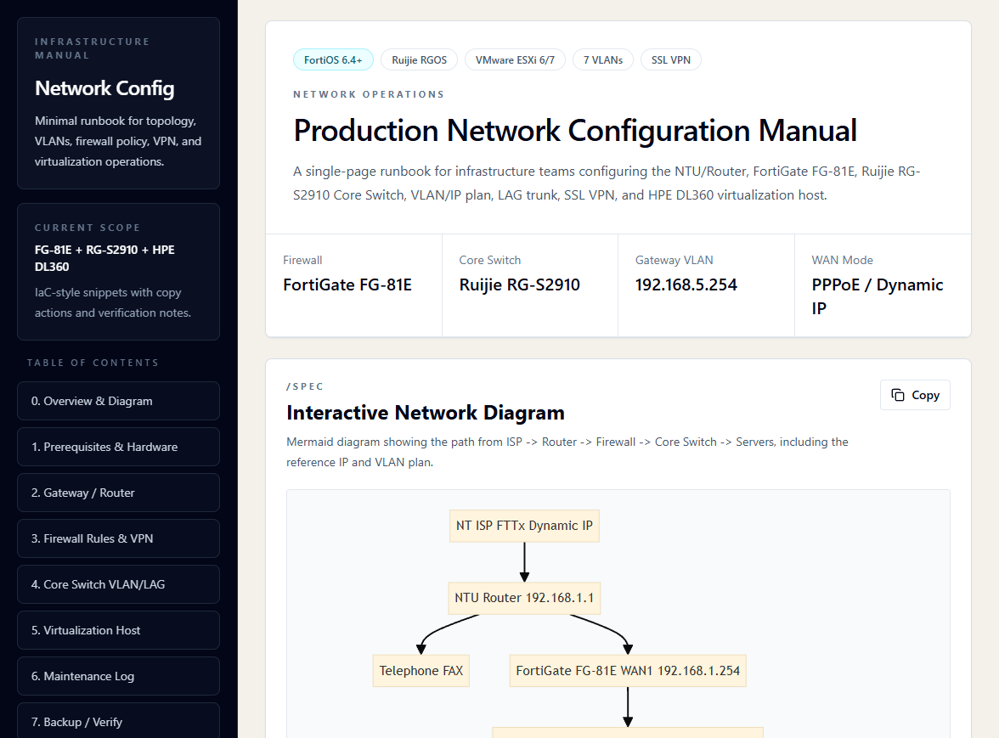

# Network Config Manual

> A minimal Infrastructure-as-Code inspired portal for turning complex network topology and device configuration into an interactive, searchable operations manual.

[](https://network-configuration-guide.vercel.app)
[](#license)
[](#tech-stack)
[](#key-features)



## 🚀 Live Demo

| Environment | URL |
| --- | --- |
| Production | [network-configuration-guide.vercel.app](https://network-configuration-guide.vercel.app) |

## 📌 Overview

Network Config Manual is a clean, single-page documentation portal for operations teams that need one reliable place to inspect network topology, hardware specs, VLAN/IP planning, firewall policy, VPN settings, server notes, and reusable configuration snippets.

Instead of keeping diagrams, CLI commands, and handover notes in separate files, this project treats documentation like lightweight Infrastructure-as-Code: structured, versioned, reviewable, and easy to update.

## ✨ Key Features

| Area | Capability |
| --- | --- |
| Interactive Topology | Dynamic SVG rendering powered by Mermaid.js for the ISP -> Router -> Firewall -> Core Switch -> Virtual Servers path |
| Config Snippets | Click-to-copy command blocks for router, firewall, switch, VPN, and server configuration workflows |
| Specs Dashboard | Hardware, VLAN, IP plan, and management address tables built for quick scanning |
| Responsive UI | Minimal desktop, tablet, and mobile layout with horizontal diagram scrolling for small screens |
| Operations Notes | Maintenance log, verification checklist, and rollback guidance for future network changes |

## 🧱 Tech Stack

| Technology | Role |
| --- | --- |
| Next.js | Portfolio-aligned deployment target and future upgrade path |
| Tailwind CSS | Minimal responsive UI styling |
| Lucide React / Lucide Icons | Clean icon system for actions and controls |
| Mermaid.js | Dynamic network topology rendering |
| Vercel | Static hosting and live demo deployment |

> Current implementation note: this version is intentionally shipped as a static `index.html` SPA for fast deployment. The structure is ready to migrate into a Next.js App Router project if the manual grows into a larger system.

## ⚙️ Installation & Usage

Clone the repository:

```powershell
git clone https://github.com/nattapongsindhu/network-configuration-guide.git
cd network-configuration-guide
```

Run locally:

```powershell
python -m http.server 8085 --directory .
```

Open the local app:

```text
http://localhost:8085/
```

## 🛠️ Updating Network Data

| Update Target | Where to Edit |
| --- | --- |
| Hardware specs | `Prerequisites & Hardware Specs` table in `index.html` |
| Network diagram | `#diagramSource` and `data-mermaid-source` in `index.html` |
| VLAN/IP plan | `Core Switch` table in `index.html` |
| CLI snippets | Add or edit `<article class="snippet">` blocks |
| Screenshot preview | Replace `assets/preview.png` |

Snippet template:

```html
<article class="snippet" data-title="Name">
  <div class="snippet-head">
    <span>DEVICE CLI</span>
    <button class="copy-btn" data-copy-target="unique-id" type="button">
      <i data-lucide="copy"></i>Copy
    </button>
  </div>
  <pre id="unique-id"><code>commands here</code></pre>
</article>
```

## 📝 Maintenance Log Template

| Date | Change Summary | Device / Scope | Owner | Verification | Rollback Plan |
| --- | --- | --- | --- | --- | --- |
| YYYY-MM-DD |  |  |  |  |  |
| YYYY-MM-DD |  |  |  |  |  |
| YYYY-MM-DD |  |  |  |  |  |

## ✅ Verification Checklist

| Check | Status |
| --- | --- |
| Mermaid diagram renders without syntax errors | Complete |
| Copy buttons target valid snippets | Complete |
| Browser clipboard copy works on tested snippets | Complete |
| Sticky table of contents links route to valid sections | Complete |
| Diagram remains usable on mobile through horizontal overflow | Complete |
| Semantic HTML uses `main`, `section`, `nav`, and table markup | Complete |

## 🚢 Deployment Notes

This project does not require a build step. Vercel can serve `index.html` directly from the repository root.

Recommended flow:

```powershell
git add README.md
git commit -m "docs: update README with professional badges and structure"
git push origin main
```

## 📄 License

MIT License
